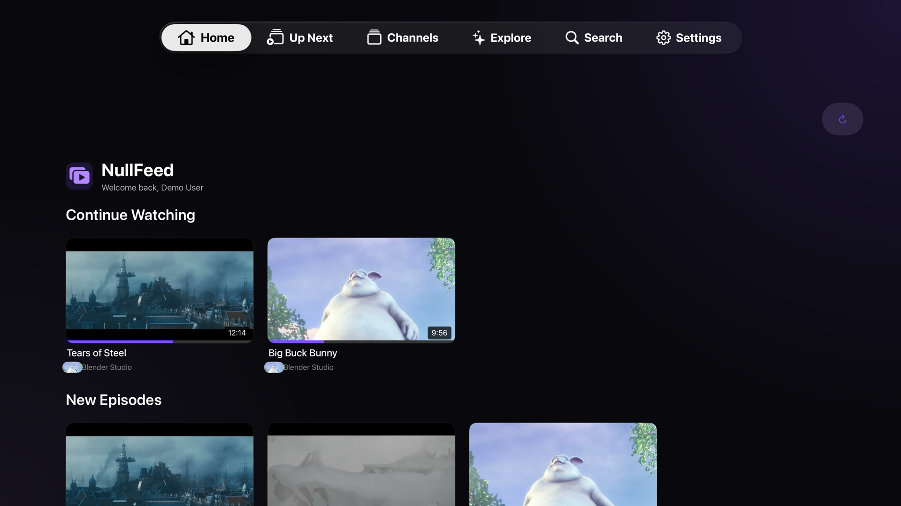
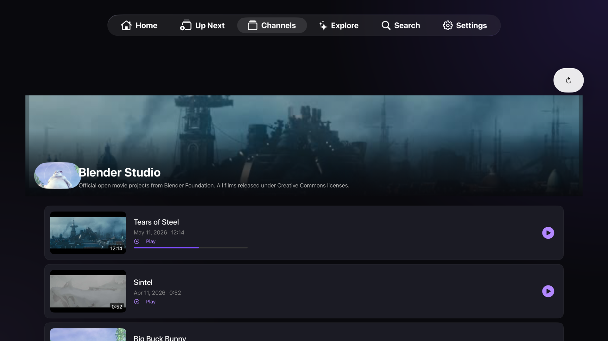
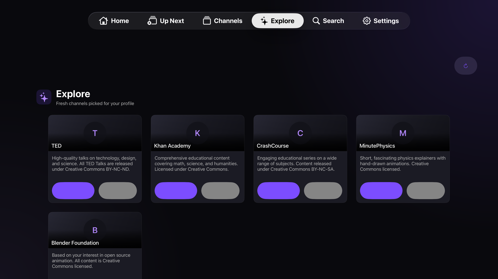

# NullFeed tvOS

**A Self-Hosted YouTube Media Center -- Apple TV App**

[](https://swift.org)
[](https://developer.apple.com/tvos/)
[](LICENSE)

NullFeed is a self-hosted YouTube media center that delivers a **streaming-service-quality** browsing and playback experience on the big screen. This native SwiftUI app targets **Apple TV**, connecting to the [NullFeed backend](https://github.com/windoze95/nullfeed-backend) running on Docker (Unraid or any Docker host).

Think Netflix, but for your YouTube subscriptions -- channel-centric navigation, resume-aware playback, multi-user profiles, and AI-powered discovery, all built for the 10-foot experience.

---

## Features

- **Instant Playback with Progressive Quality** -- Start watching immediately, even before a video finishes downloading to the server. The app begins playback with a low-quality stream, then seamlessly upgrades to the full-quality version once it's ready -- no buffering, no interruption.
- **Channel-Centric Navigation** -- Browse your subscriptions like shows in a streaming app, with channel art, banners, and episode lists.
- **Resume-Aware Home Screen** -- Continue Watching, New Episodes, and Recently Added rows keep you up to date.
- **Top Shelf Integration** -- Continue Watching items surface on the tvOS home screen, so you can jump back into a video without opening the app.
- **Native Video Playback** -- AVPlayer-backed playback with full seeking support.
- **Focus-Optimized UI** -- Designed for the 10-foot display with focus states, smooth animations, and Siri Remote navigation.
- **Multi-User Profiles** -- Profile picker with independent subscriptions, watch history, and recommendations per user.
- **AI-Powered Discover Tab** -- Claude-powered channel and video suggestions based on your subscription graph.
- **Real-Time Download Tracking** -- WebSocket-driven progress indicators for active downloads.
- **Dark Theme** -- Media-center-class dark UI built for the big screen.

---

## Screenshots

_Coming soon._

<!-- Add screenshots here:




-->

---

## Prerequisites

- [Xcode](https://developer.apple.com/xcode/) 16+
- [XcodeGen](https://github.com/yonaskolb/XcodeGen) (`brew install xcodegen`)
- Swift 6
- tvOS 17+ simulator or Apple TV device
- A running [NullFeed backend](https://github.com/windoze95/nullfeed-backend) instance

---

## Getting Started

1. **Clone the repository:**

   ```bash
   git clone https://github.com/windoze95/nullfeed-tvos.git
   cd nullfeed-tvos
   ```

2. **Generate the Xcode project:**

   ```bash
   xcodegen generate
   ```

3. **Open the project:**

   ```bash
   open NullFeed.xcodeproj
   ```

4. **Select the NullFeed scheme**, choose an Apple TV simulator or device, and build & run.

---

## Architecture

MVVM with `@Observable`, zero third-party dependencies.

### State Management -- @Observable

All ViewModels use Swift's `@Observable` macro with `@MainActor` isolation. Dependencies are injected through the SwiftUI `@Environment`, with the app entry point wiring up core services:

| ViewModel                  | Responsibility                              |
|----------------------------|---------------------------------------------|
| `AppState`                 | Session lifecycle, authentication state     |
| `AuthViewModel`            | Server connection and profile selection     |
| `HomeViewModel`            | Aggregated home feed data                   |
| `LibraryViewModel`         | Channel list with subscribe/unsubscribe     |
| `ChannelDetailViewModel`   | Single channel videos and metadata          |
| `DiscoverViewModel`        | AI recommendation state                     |
| `PlayerViewModel`          | Video playback and progressive quality      |
| `SettingsViewModel`        | Server URL and quality preferences          |

### Navigation

`TabView` with `NavigationStack` provides tab-based navigation across four sections:

1. **Home** -- Resume-aware feed with Continue Watching, New Episodes, Recently Added rows
2. **Library** -- All subscribed channels in a grid layout
3. **Discover** -- AI-powered channel recommendations
4. **Settings** -- Server connection, quality preferences, profile management

Deep linking via `nullfeed://` URL schemes enables playback from the Top Shelf and other system surfaces.

### Networking -- URLSession

All backend communication uses `URLSession` with async/await. A generic request builder handles method, path, body, and token-based auth headers. No third-party networking libraries.

### Real-Time Events -- WebSocket

A persistent `URLSessionWebSocketTask` connection provides real-time updates with auto-reconnect. Event types include download progress, download complete, preview ready, new episode, and recommendation ready.

### Data Models -- Codable

Standard Swift `Codable` structs with snake_case key decoding and ISO 8601 date parsing (with fractional seconds support) via a shared `JSONDecoder` configuration.

### Local Storage -- UserDefaults

Lightweight persistence for server URL, session token, selected user, and quality preferences. An App Group (`group.codes.julian.nullfeed`) shares credentials with the Top Shelf extension.

### Directory Structure

```
NullFeed/
├── App/             # App entry point and AppState
├── Config/          # Theme and constants
├── Models/          # Codable data models
├── Services/        # APIClient, WebSocket, Storage, ImageLoader
├── Utilities/       # JSONDecoder config, formatting helpers
├── ViewModels/      # @Observable view models
└── Views/           # SwiftUI views organized by feature
    ├── Channel/
    ├── Components/
    ├── Discover/
    ├── Home/
    ├── Library/
    ├── Navigation/
    ├── Player/
    ├── ProfilePicker/
    └── Settings/
```

---

## Configuration

On first launch, the app prompts you to enter your NullFeed server address:

- **Server URL**: `http://<server-ip>:8484` (or your custom port)

This is stored locally via UserDefaults and can be changed at any time in **Settings**. The settings screen includes a connection test to verify the backend is reachable.

After connecting, select or create a user profile to begin using the app.

---

## CI

GitHub Actions handles continuous integration:

- **CI** -- Builds and runs tests on PRs to `main`
- **TestFlight** -- Archives and uploads to TestFlight on pushes to `main`

---

## Related Repositories

| Repository | Description |
|------------|-------------|
| [nullfeed-backend](https://github.com/windoze95/nullfeed-backend) | Python/FastAPI backend -- Docker-based server with yt-dlp, Celery, Redis, and SQLite |
| [nullfeed-flutter](https://github.com/windoze95/nullfeed-flutter) | Flutter client for iOS |
| **nullfeed-tvos** (this repo) | **Native Swift/SwiftUI tvOS app** |
| [nullfeed-demo](https://github.com/windoze95/nullfeed-demo) | FastAPI demo server with Creative Commons content for App Store review |

---

## License

This project is licensed under the [GNU General Public License v3.0](LICENSE).
